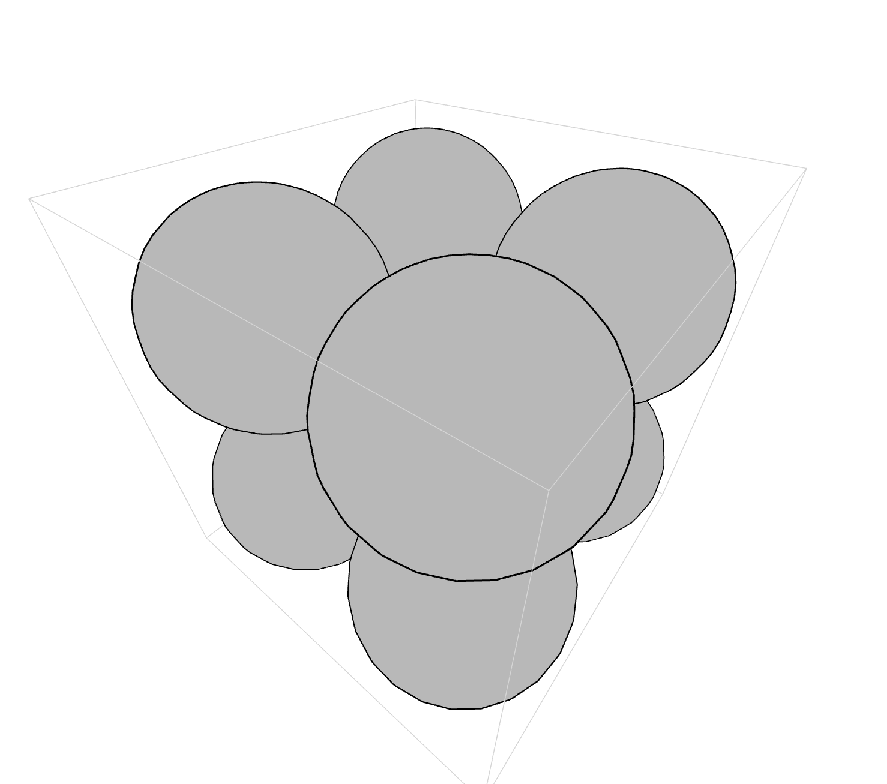

# Atum
A collection of THREE.js interactive components for geometric and mathematical visualizations about the world

### Square with 8 spheres

### Conical spirals
Describing the spiral motion of polar forces. Three planes of two inward and three planes of two outward flows, where center is motionless. The directions are NORTH, SOUTH, POSITIVE, NEGATIVE, EAST and WEST. Poles are MAGNETIC and ELECTRIC. The center is NORTH, the circumpherence is SOUTH, the blue and red are POSITIVE and NEGATIVE. Clockwise and counterclockwise are EAST and WEST respectively.

